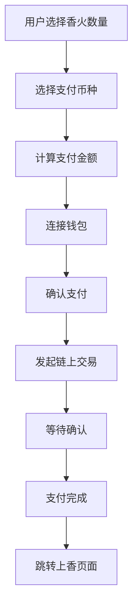

# 财神殿 Web3 钱包集成与支付功能设计

## 📋 阶段2 - 设计概述
根据项目总体设计，阶段2主要实现Web3钱包集成和支付功能，为用户提供安全、便捷的加密货币支付体验。

## 🎯 功能目标

### 核心功能
1. **多钱包支持** - 支持主流Web3钱包连接
2. **多币种支付** - 支持SOL, USDT, BTC, ETH等多种加密货币
3. **智能定价** - 实时汇率计算和价格显示
4. **安全交易** - 安全的链上交易处理
5. **用户体验** - 简洁直观的支付流程

## 🏗️ 技术架构

### 技术栈选择
```
前端集成:
├── Web3.js / Ethers.js - 以太坊生态
├── @solana/web3.js - Solana生态  
├── WalletConnect - 多钱包协议
├── MetaMask SDK - MetaMask专用
└── Phantom API - Solana钱包

价格服务:
├── CoinGecko API - 实时币价
├── CryptoCompare API - 备用价格源
└── DEX价格聚合器
```

### 服务架构
```
wallet/
├── walletService.js      # 钱包连接核心服务
├── paymentService.js     # 支付处理服务  
├── priceService.js       # 价格查询服务
├── chainService.js       # 链服务管理
└── transactionService.js # 交易状态管理
```

## 🔗 支持的钱包和链

### 主流钱包支持
| 钱包名称 | 支持链 | 优先级 | 实现方式 |
|---------|--------|-------|---------|
| **MetaMask** | ETH, BSC, Polygon | 🥇 高 | window.ethereum |
| **Phantom** | Solana | 🥇 高 | window.solana |
| **WalletConnect** | 多链 | 🥈 中 | @walletconnect/web3-provider |
| **Coinbase Wallet** | ETH系 | 🥈 中 | @coinbase/wallet-sdk |
| **Trust Wallet** | 多链 | 🥉 低 | WalletConnect协议 |

### 支持的区块链
| 链名称 | 网络ID | 支持币种 | Gas费用 |
|-------|--------|----------|--------|
| **Ethereum** | 1 | ETH, USDT, USDC | 高 |
| **Solana** | mainnet-beta | SOL, USDC | 低 |
| **BSC** | 56 | BNB, BUSD | 中 |
| **Polygon** | 137 | MATIC, USDC | 低 |

## 💰 支付功能设计

### 支付流程


### 定价策略
```javascript
// 基础定价逻辑
const INCENSE_PRICE_USD = 1.0 // 每柱香1美元

// 定价计算
function calculatePrice(incenseCount, selectedCurrency) {
  const totalUSD = incenseCount * INCENSE_PRICE_USD
  const exchangeRate = getCurrencyRate(selectedCurrency)
  return totalUSD / exchangeRate
}
```

### 支持的币种和价格
| 币种 | 符号 | 小数位 | 最小单位 |
|-----|------|-------|---------|
| Solana | SOL | 9 | 0.001 SOL |
| Ethereum | ETH | 18 | 0.0001 ETH |
| USDT | USDT | 6 | 0.1 USDT |
| Bitcoin | BTC | 8 | 0.00001 BTC |

## 🔧 实现细节

### 1. 钱包连接服务
```javascript
// walletService.js 结构设计
class WalletService {
  // 核心方法
  async connectWallet(walletType)      // 连接指定钱包
  async disconnectWallet()             // 断开钱包连接
  getConnectedAccount()                // 获取当前账户
  getBalance(currency)                 // 获取余额
  isWalletConnected()                  // 检查连接状态
  
  // 事件监听
  onAccountChanged(callback)           // 账户切换监听
  onChainChanged(callback)             // 网络切换监听
  onDisconnected(callback)             // 断开连接监听
}
```

### 2. 支付处理服务
```javascript
// paymentService.js 结构设计
class PaymentService {
  // 支付相关
  async createPayment(amount, currency, recipient)  // 创建支付
  async executePayment(paymentData)                 // 执行支付
  async verifyTransaction(txHash)                   // 验证交易
  getTransactionStatus(txHash)                      // 查询交易状态
  
  // 价格计算
  async calculatePaymentAmount(incenseCount, currency) // 计算支付金额
  async getCurrentPrice(currency)                      // 获取当前价格
}
```

### 3. 用户界面设计

#### 钱包连接UI
```vue
<!-- WalletConnector.vue -->
<template>
  <div class="wallet-connector">
    <div v-if="!isConnected" class="wallet-selection">
      <h3>选择钱包</h3>
      <div class="wallet-grid">
        <div 
          v-for="wallet in supportedWallets" 
          :key="wallet.id"
          @click="connectWallet(wallet.id)"
          class="wallet-option"
        >
          
          <span>{{ wallet.name }}</span>
        </div>
      </div>
    </div>
    
    <div v-else class="wallet-info">
      <div class="account-info">
        <span>{{ formatAddress(currentAccount) }}</span>
        <button @click="disconnectWallet">断开连接</button>
      </div>
    </div>
  </div>
</template>
```

#### 支付界面UI
```vue
<!-- PaymentSelector.vue -->
<template>
  <div class="payment-selector">
    <!-- 香火数量选择 -->
    <div class="incense-selection">
      <label>选择香火数量:</label>
      <input 
        v-model="incenseCount" 
        type="number" 
        min="1" 
        max="99"
        @input="updatePrice"
      >
    </div>
    
    <!-- 币种选择 -->
    <div class="currency-selection">
      <label>选择支付币种:</label>
      <div class="currency-grid">
        <div 
          v-for="currency in supportedCurrencies"
          :key="currency.symbol"
          @click="selectCurrency(currency)"
          :class="['currency-option', { active: selectedCurrency?.symbol === currency.symbol }]"
        >
          
          <div class="currency-info">
            <span class="name">{{ currency.name }}</span>
            <span class="symbol">{{ currency.symbol }}</span>
          </div>
          <div class="price">
            {{ formatPrice(paymentAmount, currency.symbol) }}
          </div>
        </div>
      </div>
    </div>
    
    <!-- 支付按钮 -->
    <button 
      @click="processPayment"
      :disabled="!canPay"
      class="pay-button"
    >
      {{ payButtonText }}
    </button>
  </div>
</template>
```

## 🔐 安全考虑

### 安全措施
1. **输入验证** - 严格验证所有用户输入
2. **金额检查** - 防止异常金额支付
3. **交易确认** - 多重确认机制
4. **错误处理** - 完善的错误处理和回滚
5. **隐私保护** - 不存储敏感的钱包信息

### 风险控制
```javascript
// 安全检查示例
const SecurityChecks = {
  // 金额合理性检查
  validateAmount(amount, currency) {
    const minAmount = getMinAmount(currency)
    const maxAmount = getMaxAmount(currency)
    return amount >= minAmount && amount <= maxAmount
  },
  
  // 余额充足检查
  async checkBalance(account, amount, currency) {
    const balance = await getBalance(account, currency)
    const gasEstimate = await estimateGas(currency)
    return balance >= (amount + gasEstimate)
  },
  
  // 交易限制检查
  checkTransactionLimits(account, amount) {
    // 实现交易频次和金额限制
    return true
  }
}
```

## 📱 用户体验设计

### 交互流程
1. **直观选择** - 清晰的钱包和币种选择界面
2. **实时反馈** - 价格实时更新和余额显示
3. **状态提示** - 连接状态、交易进度的明确提示
4. **错误处理** - 友好的错误提示和解决建议

### 响应式设计
- **移动端优化** - 触摸友好的按钮和布局
- **网络适配** - 不同网络状况的加载优化
- **跨平台兼容** - 确保各种设备和浏览器的兼容性

## 🧪 测试策略

### 测试环境
| 环境 | 网络 | 用途 |
|-----|------|------|
| **开发** | Testnet | 开发调试 |
| **测试** | Testnet | 功能测试 |
| **预生产** | Mainnet | 压力测试 |
| **生产** | Mainnet | 正式运行 |

### 测试用例
1. **钱包连接测试** - 各种钱包的连接和断开
2. **支付流程测试** - 完整支付流程的各种场景
3. **异常处理测试** - 网络错误、余额不足等异常情况
4. **安全测试** - 安全漏洞和攻击向量测试
5. **性能测试** - 高并发和大金额交易测试

## 📊 数据统计

### 关键指标
- **钱包连接成功率** - 各钱包的连接成功率统计
- **支付完成率** - 支付流程的完成率分析
- **平均交易时间** - 不同链的交易确认时间
- **Gas费用统计** - 各链的Gas费用趋势
- **用户偏好分析** - 用户对钱包和币种的选择偏好

### 监控告警
```javascript
// 监控指标设置
const MonitoringMetrics = {
  walletConnectionFailRate: { threshold: 5, period: '1h' },
  paymentFailRate: { threshold: 3, period: '30m' },
  transactionTimeout: { threshold: 300, period: 'per_tx' },
  gasUsageSpike: { threshold: 200, period: '15m' }
}
```

## 🚀 部署和维护

### 部署检查清单
- [ ] 测试网络功能验证
- [ ] 主网合约地址配置
- [ ] API密钥安全配置
- [ ] 错误监控系统部署
- [ ] 备用服务节点配置

### 运维监控
1. **实时监控** - 交易状态和系统健康度
2. **日志记录** - 详细的操作和错误日志
3. **性能优化** - 持续的性能分析和优化
4. **安全更新** - 及时的安全补丁和更新

## 📈 未来扩展

### 后续功能
1. **DeFi集成** - 与DeFi协议的集成
2. **NFT支持** - NFT形式的功德凭证
3. **跨链桥接** - 跨链资产转移支持
4. **智能合约** - 自定义的智能合约功能
5. **DAO治理** - 社区治理机制

### 技术升级
- **Layer 2支持** - 集成Layer 2解决方案降低费用
- **新链支持** - 持续增加新的区块链支持
- **钱包扩展** - 支持更多新兴钱包
- **API优化** - 提升API响应速度和稳定性

---

## 💡 讨论要点

### 需要确认的技术决策
1. **钱包优先级** - 哪些钱包需要优先支持？
2. **币种选择** - 具体支持哪些币种？优先级如何？
3. **定价策略** - 固定价格 vs 动态定价？
4. **手续费处理** - 用户承担 vs 平台补贴？
5. **交易确认** - 需要几个区块确认？

### 技术实现疑问
1. **价格更新频率** - 多久更新一次价格？
2. **交易超时处理** - 交易超时如何处理？
3. **失败重试机制** - 支付失败是否允许重试？
4. **多币种同时支持** - 是否允许混合支付？
5. **汇率风险控制** - 如何处理汇率波动？

### 用户体验考虑
1. **新手引导** - 是否需要钱包使用教程？
2. **支付确认** - 需要哪些确认步骤？
3. **错误提示** - 如何让错误提示更友好？
4. **国际化支持** - 不同地区的本地化需求？
5. **性能优化** - 如何平衡功能和性能？

---

**文档版本**: v1.0  
**创建时间**: 2024年1月15日  
**状态**: 📝 待讨论 